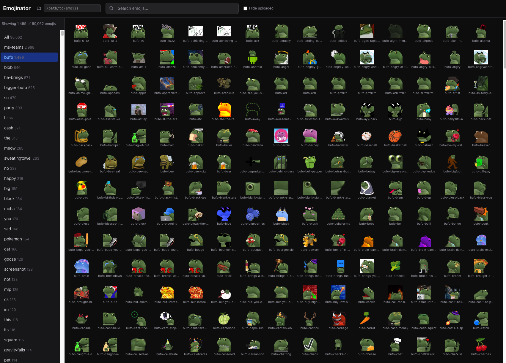

# Emojinator

Browse, search, and bulk upload custom emojis to Slack.

  



## Features

- **Browse** thousands of emojis in a virtualized grid (handles 90k+ images)
- **Search** by name with instant filtering
- **Group** emojis automatically by filename prefix (e.g. `bufo-*`, `blob-*`, `ms-teams-*`)
- **Select** individual emojis or entire groups for bulk operations
- **Upload** to Slack with automatic rate limit handling, retry, and duplicate skipping
- **Hide uploaded** emojis to see only what's left to upload
- **Browse folders** with a built-in file system browser to pick your emoji directory
- **Save credentials** locally so you don't have to re-enter them

## Quick Start

```bash
git clone https://github.com/Kvadratni/emojinator.git
cd emojinator
npm install
npm run dev
```

Open [http://localhost:3000](http://localhost:3000) and use the folder icon in the header to point to your emoji directory.

> **Tip:** If you use `min-release-age` in `~/.npmrc` or `exclude-newer` in `~/.config/uv/uv.toml`, make sure packages aren't being blocked. This project uses recent versions of Next.js 16, React 19, and react-window 2.

## Getting Slack Credentials

To upload emojis, you need three things from your Slack workspace:

### 1. Team Name
The subdomain of your Slack workspace URL (e.g. `myworkspace` from `myworkspace.slack.com`).

### 2. API Token (xoxc-...)
1. Open your Slack workspace in a browser
2. Press F12 to open DevTools, go to the **Network** tab
3. Upload any emoji manually through Slack's UI
4. Find the `emoji.add` request in the Network tab
5. Look in the request **payload** for the `token` field starting with `xoxc-`

### 3. Session Cookie
1. In the same DevTools **Network** tab
2. Click any request to your Slack workspace
3. Copy the full **Cookie** header from the Request Headers
4. It must include the `d=xoxd-...` value (this is an HttpOnly cookie not accessible via `document.cookie`)

Credentials are saved to your browser's localStorage and never sent anywhere except directly to Slack's API.

## Tech Stack

- [Next.js 16](https://nextjs.org/) (App Router, Turbopack)
- [React 19](https://react.dev/)
- [react-window 2](https://github.com/bvaughn/react-window) (virtualized grid)
- [Tailwind CSS 4](https://tailwindcss.com/)
- TypeScript

## Project Structure

```
src/
  app/
    api/
      browse/       # Directory browser endpoint
      config/       # Emoji directory configuration
      emojis/       # Emoji index (scan + prefix detection)
      existing-emojis/ # Fetch existing Slack emojis
      image/        # Image proxy (serves from configured dir)
      upload/       # Slack upload with SSE progress
    page.tsx        # Main page
  components/
    EmojiCard.tsx   # Single emoji tile
    EmojiGrid.tsx   # Virtualized grid (react-window)
    FolderPicker.tsx # Directory browser dialog
    SearchBar.tsx   # Debounced search
    SelectionBar.tsx # Selection actions bar
    Sidebar.tsx     # Prefix group navigation
    Spinner.tsx     # Loading overlay
    UploadDialog.tsx # Upload modal with progress
  hooks/
    useEmojiData.ts # Emoji fetching, filtering, grouping
    useSelection.ts # Selection state management
  lib/
    config.ts       # Server-side directory config
    emoji-store.ts  # Shared types
    prefix-detector.ts # Filename prefix grouping algorithm
    scan-emojis.ts  # Filesystem scanner
    slack-uploader.ts  # Slack API upload with rate limiting
```

## How It Works

1. **Scanning**: On startup, reads the configured emoji directory and groups files by filename prefix (splitting on `-` and `_`). Groups with 5+ members become sidebar categories.

2. **Serving**: Images are served through an API proxy route (`/api/image/`) from the configured directory. No symlinks or copying needed.

3. **Uploading**: Uses Slack's `emoji.add` API with your session cookie + xoxc token. Includes:
   - Pre-flight check of existing emojis to skip duplicates
   - Automatic rate limit detection (HTTP 429 + API-level `ratelimited`)
   - Exponential backoff with up to 10 retries
   - Real-time progress via Server-Sent Events
   - Emoji name sanitization (lowercase, alphanumeric, hyphens, underscores)

## License

MIT
